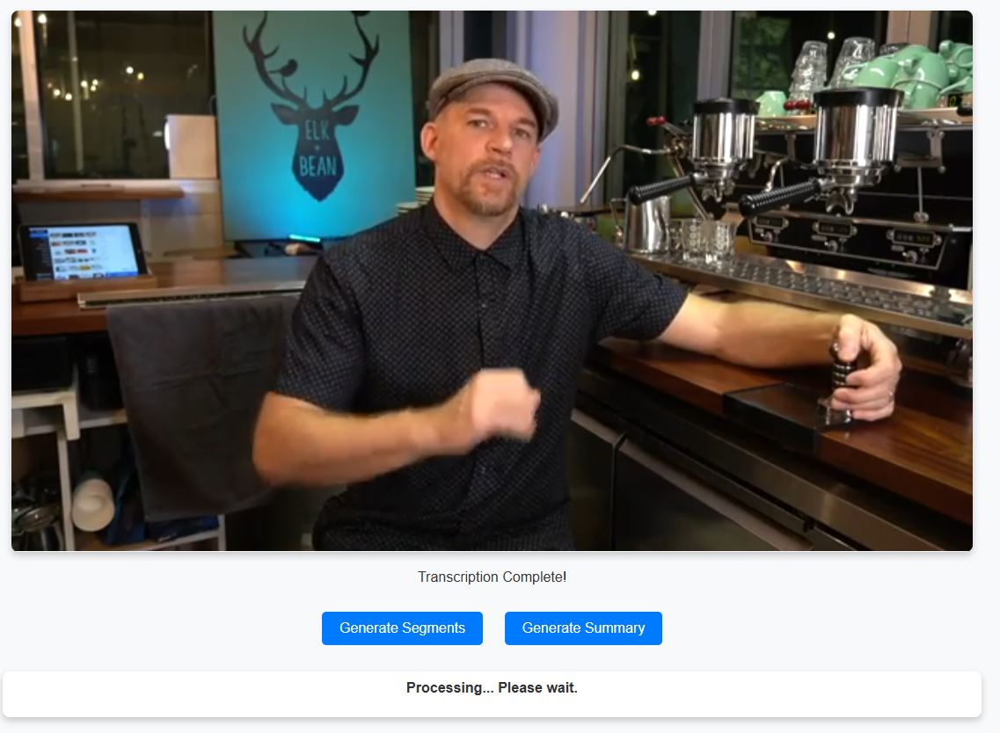
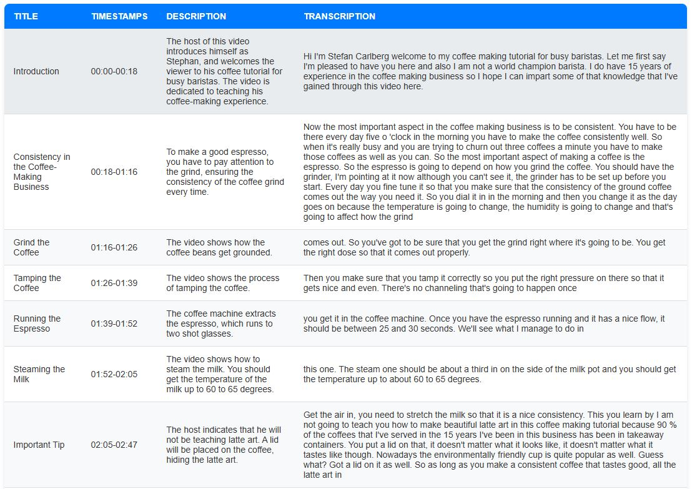

# Unsupervised Action Segmentation and Scene Understanding

## 🚀 Project Overview
With the rapid increase in online instructional videos, navigating long-form content efficiently remains a challenge. This project presents an **unsupervised approach** for **action segmentation and scene understanding**, leveraging **audio and visual cues** to automatically divide instructional videos into meaningful segments.

### 🔹 Key Features
- **Automatic Video Segmentation**: Detects distinct action steps without manual annotation.
- **Multimodal Analysis**: Uses both **visual scene changes** and **audio transcriptions**.
- **Google Gemini Integration**: Enhances segmentation by incorporating both **visual and speech context**.
- **Flask Web Application**: Users can upload videos and receive structured chapter-based insights.
- **JSON Output**: Titles, timestamps, descriptions, and transcriptions are neatly structured.

## 📸 Screenshots
### 🎬 Upload Page

### 📑 Generated Segments


## 🎥 Demo Video
Check out the demo showcasing the project in action:


## 🛠️ Installation
### 1️⃣ Clone the Repository
```bash
git clone https://github.com/alan-wkm/alan-fyp-2024
```

### 2️⃣ Set Up Virtual Environment
```bash
python -m venv .venv
source .venv/bin/activate  # On Windows: venv\Scripts\activate
```

### 3️⃣ Install Dependencies
```bash
pip install -r requirements.txt
```

### 4️⃣ Run the Flask Web App
```bash
python app.py
```
The application will be available at `http://127.0.0.1:5000`.

## 🏗️ Methodology
1. **Frame Extraction**: OpenCV extracts video frames at 1 FPS.
2. **Scene Segmentation**:
   - **K-Means Clustering with ResNet50** for frame clustering.
   - **PySceneDetect** for scene change detection.
3. **Speech-to-Text Processing**:
   - **Faster Whisper** extracts **transcriptions with word timestamps**.
4. **Google Gemini API**:
   - Segments video based on **multimodal cues**.
   - Outputs structured JSON with **titles, timestamps, and descriptions**.

## 📌 Results
- Achieved **~90% accuracy** in action segmentation.
- Generated **structured and interpretable chapters**.
- Improved **navigation efficiency** in instructional videos.

## 🚀 Future Improvements
- **Real-time Processing** with optimized video segmentation.
- **User Feedback Mechanism** for refining chapter accuracy.

## 📜 Citation
If you use this project, please cite:
```
@misc{alan-wkm,
  author = {Alan Wong},
  title = {Unsupervised Action Segmentation and Scene Understanding},
  year = {2025},
  url = {https://github.com/alan-wkm/alan-fyp-2024}
}
```

## 🤝 Contributing
Contributions are welcome! Feel free to submit a pull request.

## 📧 Contact
For any questions, reach out via [alan-wkm@outlook.com](mailto:alan-wkm@outlook.com).

---
**License**: MIT


**Additional Software used:**
-Nvidia Cuda version 12.6, based on graphics card\
-pyTorch installation is needed based off the corresponding graphics card\
-FFmpeg installed to allow for audio pre-processing\
Downloaded via (https://www.gyan.dev/ffmpeg/builds/), and select git-full then add the downloaded "bin" folder into path directory\